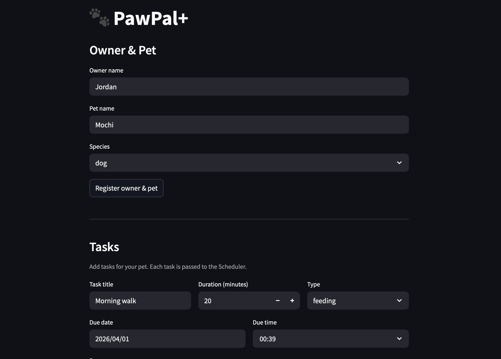

# PawPal+

**PawPal+** is a Streamlit app that helps pet owners build and manage a consistent care schedule for their pets. It tracks tasks across multiple pets, automatically surfaces the most urgent care first, warns about scheduling conflicts, and rolls recurring tasks forward so nothing ever falls through the cracks.

---

## Features

### Owner & Pet Management
Register an owner and one or more pets in a single step. Each pet maintains its own task history, and every owner is tracked independently so the system can detect cross-pet scheduling conflicts.

### Chronological Task Sorting
All schedule views are sorted by due date, earliest first. When two tasks share the exact same time slot, a secondary medical-priority sort breaks the tie automatically:

| Priority | Task type |
|---|---|
| 1 (highest) | Medication |
| 2 | Vet visit |
| 3 | Feeding |
| 4 | Exercise |
| 5 | Grooming |

This ensures a pet owner always sees the most critical care at the top of their list, without any manual re-ordering.

### Conflict Detection
Before every task is saved, the scheduler checks the owner's full pending task list for a 30-minute overlap window. Two conflict types are reported:

- **Same-pet conflict** — the pet already has a task in that slot.
- **Cross-pet owner conflict** — the owner is already occupied with a different pet at that time.

The task is always saved — the owner stays in control — but a clear warning is shown immediately so they can reschedule if needed. Completed tasks never trigger a false conflict.

### Recurring Task Auto-Advance
Tasks can repeat on a `daily`, `weekly`, or `monthly` cadence. When a recurring task is completed, `get_next_occurrence()` calculates the next due date anchored to today — not the original due date. This means completing an overdue daily feeding will always schedule the next one for tomorrow at the same time, never in the past.

### Status History
Completed tasks are preserved as a permanent record rather than deleted. The task list splits into two tabs:

- **Pending** — sorted chronologically, with medical-priority color badges (🔴 medication → 🔵 grooming).
- **Completed** — full history of every task that has been marked done.

Three header metrics (Pending / Completed / Total) give an at-a-glance count before the table loads.

### Overdue Detection
Any pending task whose due date has passed is flagged automatically. The overdue list is sorted oldest-first so the most neglected task surfaces at the top. Overdue tasks appear above upcoming tasks in the schedule view so nothing critical is buried.

### Schedule Builder
A slider lets the owner choose a lookahead window (1–30 days). Clicking **Generate schedule** runs two Scheduler queries:

1. `get_upcoming_tasks(days)` — returns all pending tasks in the window, sorted by time then priority.
2. `check_overdue_tasks()` — surfaces any tasks already past their due date.

A confirmation banner reports the total task count for the selected window.

---

## Scenario

The scheduler goes beyond a simple task list with four algorithmic improvements:

**Priority-aware sorting** — `get_upcoming_tasks(days)` sorts first by due time, then by task type when two tasks share the same slot. Medication and vet visits always surface above grooming or exercise, so a pet owner sees the most critical care first.

**Status filtering** — `get_tasks_by_status(status)` lets callers query `"pending"` or `"completed"` tasks independently. Completed tasks are preserved as a history record rather than deleted, and `check_overdue_tasks()` returns the oldest overdue item first so nothing critical gets buried.

**Recurring task auto-advance** — `Task.complete()` marks a task done permanently. For recurring tasks (`"daily"`, `"weekly"`, `"monthly"`), `get_next_occurrence()` calculates the next due date anchored to today using `timedelta`, not the original (potentially stale) due date. This means completing an overdue daily feeding always schedules the next one for tomorrow at the same time — never in the past.

**Conflict detection** — `has_conflict(task)` checks every new task against all pending tasks for the same owner, covering two cases: a same-pet overlap (the pet already has something in that window) and a cross-pet owner conflict (the owner is already occupied with another pet at that time). Rather than blocking the add, a descriptive warning string is returned so the owner stays informed but in control.

## Testing PawPal+

### Running the tests

```bash
python -m pytest tests/test_pawpal.py -v
```

### What the tests cover

The test suite has 13 tests across three areas:

**Sorting correctness** — verifies that `get_upcoming_tasks()` always returns tasks in chronological order regardless of insertion order. Two additional tests confirm the medical-priority tie-break (medication beats feeding beats grooming when tasks share the exact same time slot) and that unknown task types fall gracefully to the end of the list.

**Recurrence logic** — confirms that `get_next_occurrence()` returns a date approximately 1 day (daily) or 7 days (weekly) from now, that a non-recurring task returns `None`, and — critically — that completing an overdue recurring task still schedules the next occurrence in the future, never in the past.

**Conflict detection** — verifies three distinct cases: a same-pet double-booking returns a `SAME-PET` warning, a same-owner cross-pet overlap returns an `OWNER` warning, and tasks belonging to different owners never conflict. A fourth test confirms that completed tasks free their time slot so a new task can be added without a false conflict.

### Confidence level

**★★★★☆ (4 / 5)**

All 13 tests pass and cover the three core behaviors the scheduler advertises: priority-aware sorting, recurring task auto-advance, and conflict detection. The test suite handles the main happy paths and the most important edge cases (overdue recurrence, completed-task slot release, unknown task types, same-time tie-breaking).

One star is withheld because the tests run against in-memory state and fixed offsets from `datetime.now()`. Real-world risk areas not yet covered include persistence across restarts, the Streamlit UI layer, and month-boundary behavior for `"monthly"` recurrence (which uses a fixed 30-day delta rather than a calendar month).

---

### DEMO 



## Getting started

### Setup

```bash
python -m venv .venv
source .venv/bin/activate  # Windows: .venv\Scripts\activate
pip install -r requirements.txt
```

### Suggested workflow

1. Read the scenario carefully and identify requirements and edge cases.
2. Draft a UML diagram (classes, attributes, methods, relationships).
3. Convert UML into Python class stubs (no logic yet).
4. Implement scheduling logic in small increments.
5. Add tests to verify key behaviors.
6. Connect your logic to the Streamlit UI in `app.py`.
7. Refine UML so it matches what you actually built.
